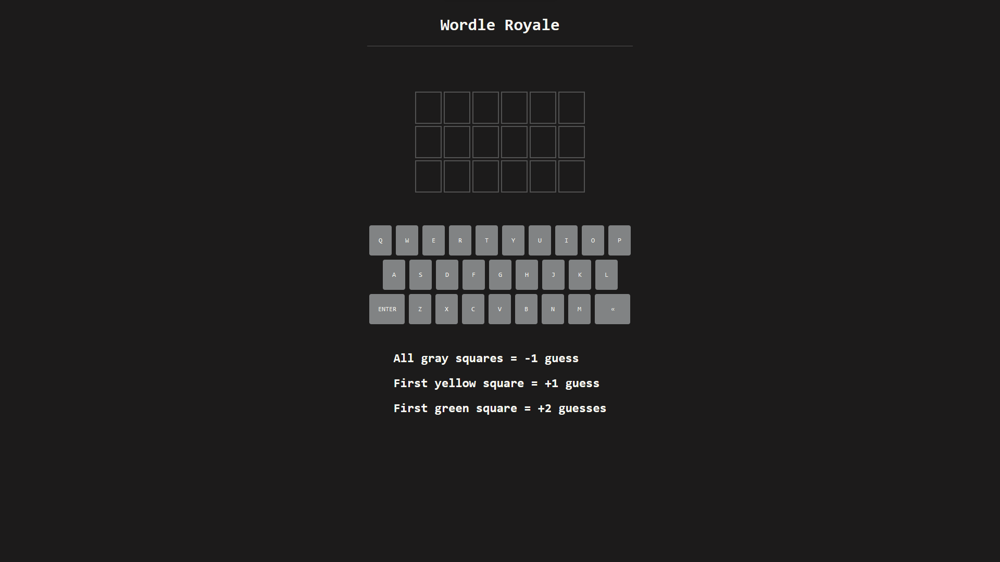

# Classes

This is a repository to document the work done in some of my university classes.

-   **Data Structures** - Labs and assignments from my data structures course implemented in both java and python
-   **Deep Learning** - Different assignments and models from my deep learning course using python and jupyter notebooks
-   **Intro to Game Design** - Homework assignments as well as a semester long project to develop a game done in javascript

# Wordle Royale

-   [Worlde Royale](#wordle-royale)
-   [Different Situations](#different-situations)
    -   [All Gray Squares](#all-gray-squares)
    -   [First Yellow Square](#first-yellow-square)
    -   [First Green Square](#first-green-square)
    -   [First Green and Yellow Squares](#first-green-and-yellow-squares)
    -   [Subsequent Green or Yellow Squares](#subsequent-green-or-yellow-squares)
    -   [Winning](#winning)
    -   [Losing](#losing)
-   [Want to Learn More?](#learn-more)

## All Gray Squares

https://user-images.githubusercontent.com/65800865/183723574-d5966e1a-882c-4ecf-8a80-11a8f22d5e38.mp4

## First Yellow Square

https://user-images.githubusercontent.com/65800865/183723744-acd4444a-cd62-4950-ae5f-2bde20b47316.mp4

## First Green Square

https://user-images.githubusercontent.com/65800865/183723670-293bc1de-6545-4445-8d71-797b5f3739cd.mp4

## First Green and Yellow Squares

https://user-images.githubusercontent.com/65800865/183723788-ffa74ba6-a0d0-47b1-a557-ae419763a774.mp4

## Subsequent Green or Yellow Squares

https://user-images.githubusercontent.com/65800865/183723836-7d8ce2bb-7598-4f20-b53a-db5c064f6c4d.mp4

## Winning

https://user-images.githubusercontent.com/65800865/183723966-238e38cb-8330-46ad-9612-128bb2176d9e.mp4

## Losing

https://user-images.githubusercontent.com/65800865/183724021-0bb3e48a-c52f-4b1d-adf4-0d6069ada5eb.mp4

  

# Learn More

Want to see it in action? [Watch my final project demonstration video!](https://www.youtube.com/watch?v=D_Eb5b_8feQ)
